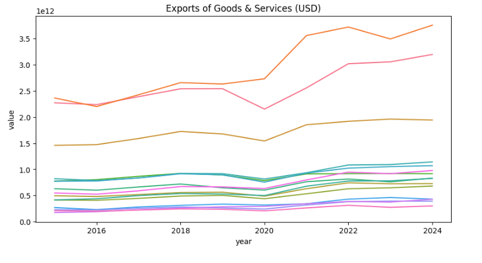
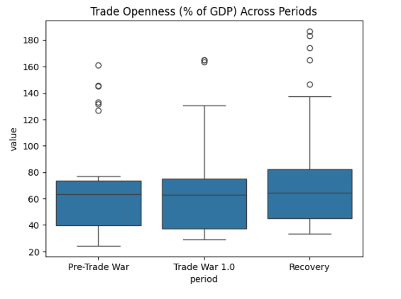
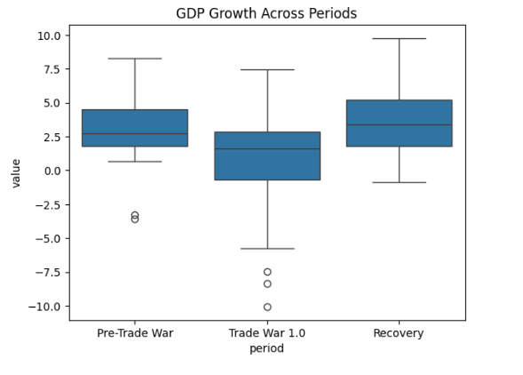
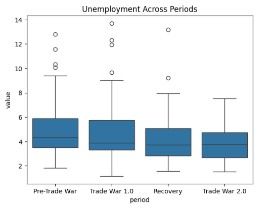
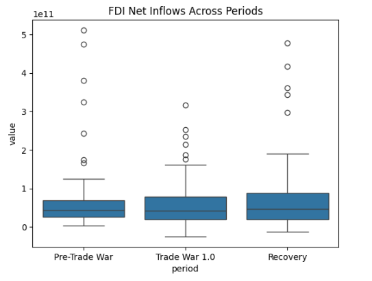
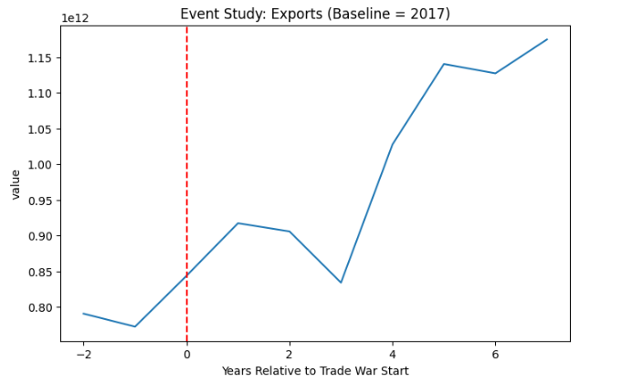
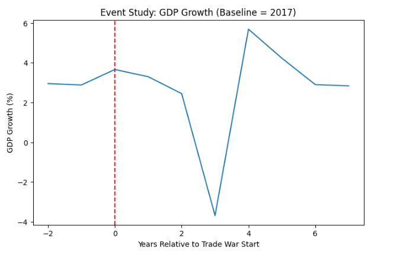
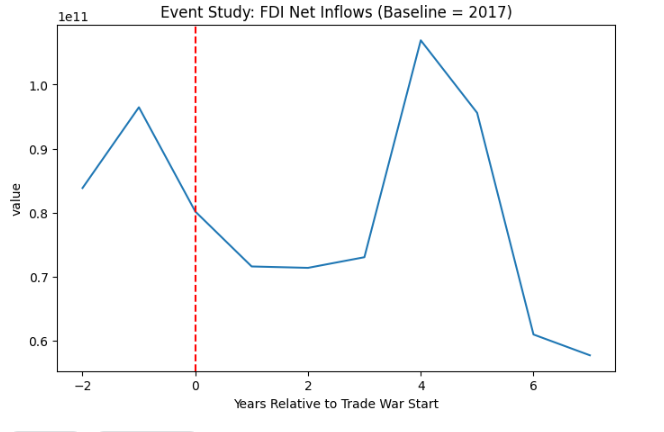

# Trade Wars and Macroeconomic Impacts
### A Multi‑Country Panel Data Analysis


---

## 📌 Project Overview
This project provides an empirical analysis of the macroeconomic impacts of global trade wars using a **multi‑country panel dataset (2015–2025)**.

The study evaluates how trade war shocks transmit through different economic channels, including:
- International trade flows  
- Output and growth dynamics  
- Labor market outcomes  
- Foreign direct investment (FDI)  

The analysis combines **exploratory data analysis (EDA)**, **event‑study identification**, and **fixed‑effects panel regressions** to isolate trade‑war effects from global shocks such as the COVID‑19 pandemic.

---

## 📂 Repository Structure

``` text
Trade-Wars-Macroeconomic-Impacts/
│
├── data/
│   └── trade_volume_annual.csv
│
├── notebooks/
│   └── Trade_Wars_Macroeconomic_Impacts_Panel_Analysis.ipynb
│
├── outputs/
│   └── figures/
│
├── README.md
└── requirements.txt
```

---

## 🔍 Methodology
1. Data cleaning and integrity checks  
2. Period and indicator validation  
3. Subset‑wise exploratory data analysis  
4. Event‑study analysis (baseline year: 2017)  
5. Fixed‑effects regressions with robust standard errors  

---

## 📊 Key Visual Results

### Trade Dynamics




---

### GDP & Growth


---

### Labor Market


---

### Investment (Key Channel)


---

## ⏱ Event‑Study Evidence

### Exports


### GDP Growth


### FDI Net Inflows


---

## 🔑 Core Findings
- Trade wars did **not** cause persistent declines in aggregate trade or GDP.
- GDP growth volatility increased, but mean growth remained resilient.
- Labor markets were largely buffered until the global pandemic shock.
- **Foreign direct investment shows the strongest and most persistent response to trade wars**, highlighting the role of policy uncertainty and investor expectations.

---

## 📎 Full Analysis
The complete workflow, code, and econometric results are available in:

**`notebooks/Trade_Wars_Macroeconomic_Impacts_Panel_Analysis.ipynb`**

---

## 🛠 Tools & Libraries
- Python  
- pandas, numpy  
- matplotlib, seaborn  
- statsmodels  

---

## 📄 License
This project is licensed under the **MIT License**.
